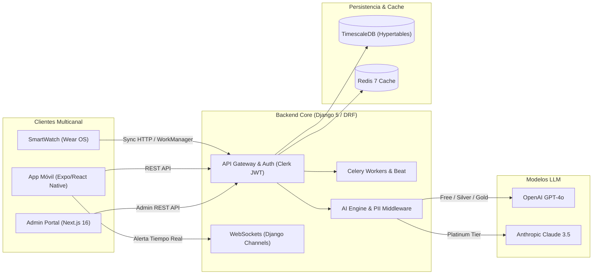
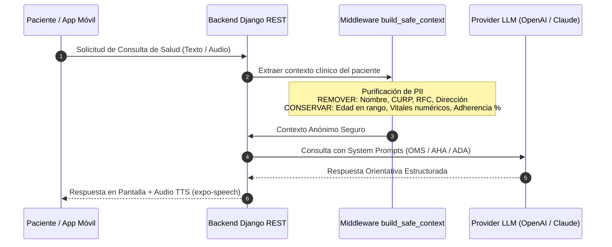

# MailyT-Cuida (CAMSA)
### *Ecosistema Empresarial de Salud Digital, Telemedicina y Telemetría Predictiva impulsado por Inteligencia Artificial Multicanal*

---


---

## El Arte de Entender antes de Construir: El Origen

> *"Detrás de cada lectura de presión arterial, de cada dosis de medicamento y de cada alerta de frecuencia cardíaca, no hay simplemente datos... hay historias humanas, familias y momentos insustituibles que merecen ser protegidos."*

Cuando la organización médica corporativa **CAMSA** presentó el reto inicial, la necesidad parecía directa: *desarrollar un sistema para el monitoreo de pacientes a distancia*. Sin embargo, al analizar el panorama existente en el mercado, nos encontramos con un problema común en el software médico tradicional: plataformas frías, interfaces complejas que ahuyentaban a los adultos mayores, datos aislados sin análisis en tiempo real y una completa falta de consistencia en el seguimiento diario.

**No nos limitamos a construir una aplicación más.** Decidimos transformar una necesidad corporativa en un **ecosistema integral de salud digital de nivel producción**. Rediseñamos la experiencia desde cero, creamos un motor de adherencia basado en gamificación, desarrollamos una arquitectura de backend escalable basada en series de tiempo con **TimescaleDB**, integramos un **motor de IA conversacional multi-modelo (OpenAI & Anthropic Claude)** protegido por una capa estricta de anonimización de datos (PII), y extendimos la telemetría hasta la muñeca del usuario mediante una **aplicación nativa Wear OS para SmartWatch**.

Esta es la historia de cómo convertimos la tecnología médica en una herramienta preventiva, humana y tecnológicamente impecable.

---

## Stack Tecnológico

### Languages
<p>
  
</p>

### Frontend and Mobile
<p>
  
</p>

### Backend and Databases
<p>
  
</p>

### Cloud, DevOps and Tooling
<p>
  
</p>

---

## Benchmarking: La Evolución de la Salud Digital

Para construir una solución líder, analizamos las limitaciones del monitoreo remoto de pacientes (RPM) tradicional y diseñamos **MailyT-Cuida** como una respuesta de nueva generación:

| Dimensión | Monitoreo RPM Tradicional | MailyT-Cuida (CAMSA Ecosistema) |
| :--- | :--- | :--- |
| **Experiencia de Usuario (UX)** | Formularios estáticos, interfaces grises y complejas. Alta tasa de abandono. | **UI/UX Móvil Fluida (Expo/React Native)** con diseño intuitivo, modo oscuro/claro y micro-animaciones. |
| **Captura de Signos Vitales** | Registro 100% manual por parte del paciente (propenso a errores u olvidos). | **Telemetría Automática e Híbrida**: Captura pasiva continua en SmartWatch (Wear OS) + subida con foto asistida. |
| **Inteligencia Artificial** | Inexistente o chatbots rígidos basados en reglas simples de texto. | **Motor IA Generativo & Predictivo Multi-Tier** (GPT-4o & Claude 3.5 Sonnet) con anonimización PII. |
| **Rendimiento de Base de Datos** | Relacional estándar (PostgreSQL/MySQL), lento para millones de lecturas continuas. | **TimescaleDB (Hypertables)**: Optimizado para series temporales de alta frecuencia en signos vitales. |
| **Adherencia del Paciente** | Recordatorios por SMS simples que el usuario ignora. | **Motor de Gamificación & Ledger de Puntos**: Recompensas reales, rachas diarias e insignias coleccionables. |
| **Seguridad de Datos Clínicos** | Datos enviados a LLMs sin filtrado de identidad (Riesgo HIPAA / LGPDPPSO). | **Capa Anónima `build_safe_context`**: Filtrado estricto de PII antes de cualquier procesamiento externo de IA. |
| **Ecosistema Multicanal** | Solo Web o Solo App. | **Ecosistema 4-en-1**: App Móvil + Portal Web Admin (Next.js 16) + Backend REST/WS + Wear OS App. |

---

## Rediseño UX/UI & Pantallas Inteligentes

El compromiso del paciente con su tratamiento depende directamente de la simplicidad de la interfaz. **MailyT-Cuida** introduce un diseño centrado en el ser humano donde la información crítica se presenta de forma clara y accesible para usuarios de todas las edades.


### Innovaciones Clave en la Experiencia de Usuario:
* **Dashboard Dinámico Contextual**: Adapta los elementos visibles según la hora del día (medicamentos de la mañana, tomas de signos vitales, resumen de hábitos).
* **Asistente Clínico Multimodal con Voz**: Interfaz de chat conversacional con activación de micrófono (`expo-av`), indicador visual de pulso auditivo y sintaxis adaptada para respuestas en audio (Text-To-Speech).
* **Visualización Intuitiva de Tendencias**: Gráficas de signos vitales con código de colores instantáneo (Verde: Rango Óptimo, Amarillo: Atención, Rojo: Anomalía).
* **Acceso Multi-Rol**: Vistas optimizadas según el rol de la persona que inicia sesión (**Paciente**, **Doctor**, **Especialista/Nutriólogo**, **Partner Corporativo** o **Administrador**).

---

## Arquitectura Backend & Ingeniería de Software (Clean Architecture)

El core del sistema está desarrollado sobre **Python 3.12 y Django 5.x**, estructurado bajo los principios de **Clean Architecture y Dominio Modular**. La infraestructura garantiza bajo costo operativo, tolerancia a fallos y alta escalabilidad horizontal.


### Diagrama de Flujo del Ecosistema



### Estructura Modular del Backend (`mailytcuida_backend`)

```text
mailytcuida_backend/
├── config/                  # Ajustes Django, Celery, WebSockets (Channels) y URLs
├── core/                    # Permisos por Rol (RBAC), Paginación, Excepciones, Throttling
└── apps/
    ├── accounts/            # Perfiles Paciente/Doctor, Vinculación y Sync Clerk Auth
    ├── vitals/              # Signos Vitales + Hypertables TimescaleDB + Tareas Celery
    ├── chat/                # WebSockets Doctor-Paciente (Django Channels)
    ├── ai_engine/ (M24)     # Routing OpenAI/Claude, Anonimización PII y Safety Prompts
    ├── medications/         # Catálogo de Medicinas, Horarios de Comida y Adherencia
    ├── lab_results/         # Expediente de Laboratorios y Análisis de Referencia
    ├── prescriptions/       # Recetas Digitales Firmadas con Verificación QR
    ├── appointments/        # Agendamiento de Citas Médicas y Disponibilidad
    ├── telemedicine/        # Integración de Teleconsultas (Zoom / Google Meet)
    ├── nutrition/           # Planes Nutricionales y Macro/Micronutrientes
    ├── wellness/            # Seguimiento de Sueño, Agua, Pasos y Mood Tracker
    ├── family_care/         # Red de Cuidado Familiar y Monitoreo de Dependientes
    ├── gamification/        # Engine de Puntos, Rachas, Insignias y Canjes Atómicos
    ├── coupons/             # Motor de Cupones Promocionales para Clínicas y Aliados
    ├── partners/            # Portal B2B de Empresas Aliadas (Cinépolis, Cinemex, etc.)
    ├── store/               # Tienda Virtual de Productos Médicos de la Clínica
    ├── specialists/         # Directorio de Nutriólogos, Fisioterapeutas y Booking
    ├── payments/            # Integración de Pagos Recurrentes y Webhooks con Stripe
    ├── notifications/       # Centro Unificado Push (Expo FCM/APNs), Email y SMS
    ├── analytics/           # Vistas Materializadas y Métricas de Retención
    └── audit/               # Auditoría Inmutable (IP, User-Agent, Recurso) + Sentry
```

### Principios de Ingeniería Aplicados:
1. **Series de Tiempo con TimescaleDB**: Los signos vitales se almacenan en *Hypertables* particionadas automáticamente por tiempo, permitiendo analizar millones de lecturas de presión arterial y frecuencia cardíaca en milisegundos.
2. **Procesamiento Asíncrono con Celery & Redis**: Las tareas pesadas (envío de notificaciones push, análisis de anomalías en vitales, generación de resúmenes semanales) se delegan a workers en segundo plano para mantener la API REST en tiempos de respuesta inferiores a 50ms.
3. **Control Atómico de Transacciones en Gamificación**: El canje de puntos por recompensas utiliza bloqueo pesimista en base de datos (`select_for_update`) para prevenir condiciones de carrera (*race conditions*) o fraudes de saldo.

---

## Motor de Inteligencia Artificial & Privacidad de Datos

La IA de **MailyT-Cuida** no solo responde preguntas; actúa como un **guardián preventivo de salud** configurado bajo estrictas reglas éticas y de privacidad médica.

### Pipeline de Anonimización de Datos (PII Stripping)



### Características de la Capa de IA:
* **Enrutamiento por Tier de Membresía**:
  * **Planes FREE / SILVER / GOLD**: Enrutados a **OpenAI GPT-4o-mini**, optimizando costes operativos.
  * **Plan PLATINUM**: Enrutado a **Anthropic Claude 3.5 Sonnet**, ofreciendo la máxima capacidad de razonamiento sintomático.
* **Capa de Anonimización de Datos (PII Stripping)**: La función `build_safe_context()` purifica la información antes de salir del servidor:
  * **Información Excluida**: Nombres, apellidos, identificadores oficiales (CURP/RFC), direcciones, correos ni notas en texto libre.
  * **Información Permitida**: Rango de edad (ej. "Adulto 30-40 años"), categoría genérica de medicamentos, porcentaje de adherencia y últimas 3 lecturas numéricas de vitales.
* **Protocolo de Emergencias Auto-Detectadas**: Si el usuario menciona síntomas graves (dolor en el pecho, falta de aire), la IA suspende cualquier análisis y emite inmediatamente la orden de contactar a los servicios de emergencia (911).
* **Cumplimiento Médico**: Alineado con guías de salud oficiales de la **OMS, AHA, ADA y la Secretaría de Salud de México**.

---

## Ecosistema SmartWatch / Wear OS (`MailyAssist`)

Para lograr una telemetría sin fricción, el proyecto incluye una aplicación nativa completa para relojes inteligentes Wear OS (**MailyAssist**), ubicada en `C:\Users\josep\StudioProjects\MailyAssist`.


### Arquitectura Técnica Wear OS:
* **Lenguaje & Framework**: Kotlin 2.0 con **Jetpack Compose for Wear OS**.
* **Captura Pasiva de Sensores**: Integración con **Android Health Services Client** (`HealthPassiveService.kt`) para capturar en segundo plano:
  * Frecuencia Cardíaca en tiempo real (BPM).
  * Saturación de Oxígeno en Sangre (SpO2 %).
  * Conteo diario de Pasos (Podómetro).
* **Sincronización Offline-First con WorkManager**: `SyncWorker.kt` empaqueta las lecturas cada 15 minutos (o de forma inmediata al detectar cambios bruscos) y las envía vía HTTP POST a la API de Django (`/api/v1/vitals/`). Si el reloj pierde conexión, los datos se conservan de forma segura en `DataStore` local.
* **UI Optimizada para Pantallas Circulares**: Pantallas nativas para visualización de Signos Vitales, Racha Actual y Billetera de Puntos de Gamificación.

---

## Portal Web de Administración (`admin-portal`)

Diseñado específicamente para el rol `ADMIN` de la plataforma, el portal web permite a la dirección médica de **CAMSA** supervisar la operación global en tiempo real.

* **Stack**: Next.js 16 (App Router), React 19, TypeScript 5, Tailwind CSS v4, `@clerk/nextjs`, TanStack Query y Recharts.
* **Métricas Ejecutivas en Tiempo Real (`/dashboard`)**: Gráficas de ingresos por suscripción (Stripe), distribución de pacientes por plan y KPIs de adherencia.
* **Verificación de Especialistas (`/specialists`)**: Flujo de revisión y aprobación/rechazo de nutriólogos, fisioterapeutas y médicos postulantes.
* **Auditoría Inmutable (`/audit`)**: Visor interactivo de registros de seguridad y auditoría filtrable por severidad, IP, correo de usuario y fecha.

---

## Modelo de Negocio, Membresías y Gamificación

El sistema integra un esquema de sostenibilidad comercial mediante pagos recurrentes procesados por **Stripe**:

| Plan | Precio Mensual | Beneficios de Salud & IA | Multiplicador de Puntos |
| :--- | :--- | :--- | :--- |
| **FREE** | $0 / mes | Monitoreo básico de signos vitales, registro manual y chat IA estándar. | **1x** |
| **SILVER** | $99 MXN / mes | Gráficas avanzadas de tendencias, historial ilimitado y recordatorios push. | **2x** |
| **GOLD** | $249 MXN / mes | Telemedicina prioritaria, descuentos en tienda y alertas a familiares. | **3x** |
| **PLATINUM** | $499 MXN / mes | **Acceso exclusivo a Anthropic Claude 3.5 Sonnet**, soporte 24/7 y 5x puntos. | **5x** |

### Motor de Lealtad & Gamificación:
* **Ledger Inmutable**: Cada toma de medicamento a tiempo o registro de signo vital otorga puntos base.
* **Rachas Consecutivas**: Bonificaciones especiales al cumplir 7, 14, 30, 60 y 90 días seguidos de tratamiento.
* **Canje Atómico de Recompensas**: El saldo de puntos puede canjearse por cupones en comercios asociados (Cinépolis, farmacias) o consultas médicas gratuitas.

---

## Guía de Instalación y Despliegue Local

### Requisitos Previos
* Docker Engine 24+ & Docker Compose v2+
* Node.js 20+ (para App Móvil y Portal Admin)
* Android Studio (para ejecución del módulo Wear OS `MailyAssist`)

### 1. Clonar el Repositorio
```bash
git clone https://github.com/MrFtyoQr/MailyT-CuidaLEGACY.git
cd MailyT-CuidaLEGACY
```

### 2. Despliegue de Infraestructura con Docker
```bash
# Levantar PostgreSQL (TimescaleDB), Redis, Backend Django y Workers Celery
docker-compose up -d --build
```

Los servicios quedarán disponibles en:
* **API REST Backend**: `http://localhost:8000/api/v1/`
* **Health Check**: `http://localhost:8000/health/`
* **PostgreSQL / TimescaleDB**: `localhost:5432`
* **Redis**: `localhost:6379`

### 3. Ejecución del Portal Administrador (Next.js)
```bash
cd admin-portal
npm install
npm run dev
# Disponible en http://localhost:3000
```

### 4. Ejecución de la App Móvil (Expo)
```bash
cd MailyLEGACYapp
npm install
npx expo start
```

---

## Licencia y Propiedad Intelectual

Este proyecto fue desarrollado bajo los requerimientos corporativos de **CAMSA (Corporativo Médico Intermediario)**. Todos los derechos reservados.

*"La tecnología avanzada solo alcanza su verdadero valor cuando se pone al servicio de la salud y la vida humana."*
