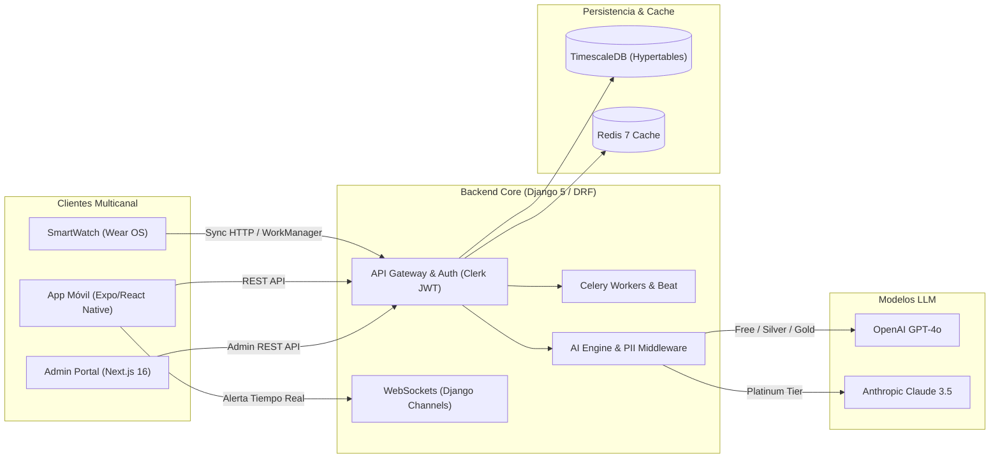
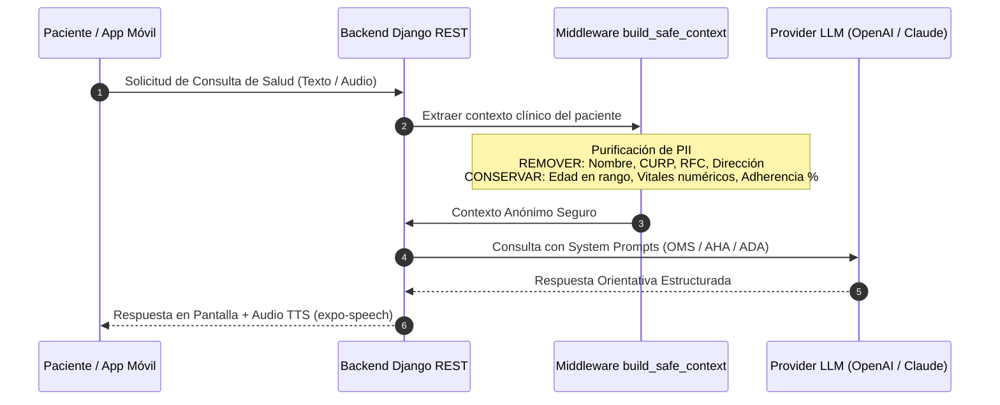

# MailyLEGACY — Plataforma de Salud Digital
### *Caso de estudio técnico sobre monitoreo de salud, experiencia multicanal e integración responsable de inteligencia artificial*

---


---

## El Arte de Entender antes de Construir: El Origen

> *"Detrás de cada lectura de presión arterial, de cada dosis de medicamento y de cada alerta de frecuencia cardíaca, no hay simplemente datos... hay historias humanas, familias y momentos insustituibles que merecen ser protegidos."*

El proyecto nació a partir de una necesidad real observada en un entorno médico: explorar una experiencia de monitoreo remoto que fuera más clara, accesible y útil para pacientes y personal de salud. Durante el análisis inicial se identificaron retos habituales en este tipo de soluciones, como interfaces complejas, registros fragmentados, seguimiento inconsistente y procesos manuales repetitivos.

**MailyLEGACY** evolucionó como una propuesta técnica de ecosistema de salud digital. El alcance documentado contempla experiencia móvil, backend modular, almacenamiento de series de tiempo, gamificación, integración de modelos de lenguaje con minimización de datos y un módulo Wear OS. Algunas capacidades cuentan con implementación parcial o prototipos funcionales; otras representan arquitectura objetivo o líneas de evolución pendientes de validación.

Este repositorio documenta la evolución técnica del proyecto, sus decisiones de arquitectura y las lecciones obtenidas al diseñar software orientado a salud.

> **Estado del proyecto:** legado técnico y prototipo en evolución. El documento distingue entre funciones implementadas, prototipos, decisiones de arquitectura y capacidades objetivo. Ninguna afirmación debe interpretarse como validación clínica, certificación normativa o disponibilidad comercial.

> **Aviso de salud:** MailyLEGACY no es un dispositivo médico, no realiza diagnósticos y no sustituye la evaluación, el tratamiento ni las indicaciones de profesionales sanitarios.


---

## Estado de las Capacidades

| Área | Estado documentado |
| :--- | :--- |
| Aplicación móvil | Prototipo y evolución técnica |
| Backend modular | Implementación parcial / arquitectura objetivo |
| Portal administrativo | Prototipo y módulos en evolución |
| Integración con IA | Pruebas, diseño de privacidad y arquitectura propuesta |
| Wear OS | Exploración técnica y prototipo independiente |
| Telemetría automática | Sujeta a compatibilidad de hardware, permisos y validación |
| Telemedicina y pagos | Capacidades planificadas o parcialmente integradas |
| Uso clínico | No validado; requiere evaluación médica, legal y regulatoria |

## Stack Tecnológico

### Languages
<p>
  
</p>

### Frontend and Mobile
<p>
  
</p>

### Backend and Databases
<p>
  
</p>

### Cloud, DevOps and Tooling
<p>
  
</p>

---

## Benchmarking: La Evolución de la Salud Digital

Como ejercicio de diseño de producto, se analizaron limitaciones frecuentes del monitoreo remoto de pacientes (RPM) y se definieron capacidades objetivo para **MailyLEGACY**. La siguiente tabla presenta una comparación conceptual; no constituye un estudio clínico ni un benchmark validado en producción:

| Dimensión | Monitoreo RPM Tradicional | MailyT-Cuida (CAMSA Ecosistema) |
| :--- | :--- | :--- |
| **Experiencia de Usuario (UX)** | Formularios estáticos, interfaces grises y complejas. Alta tasa de abandono. | **UI/UX Móvil Fluida (Expo/React Native)** con diseño intuitivo, modo oscuro/claro y micro-animaciones. |
| **Captura de Signos Vitales** | Registro principalmente manual y dependiente de constancia del usuario. | **Telemetría híbrida en evolución**: registro manual, captura asistida y exploración de sincronización con Wear OS. |
| **Inteligencia Artificial** | Chatbots basados en reglas o sin integración contextual. | **Arquitectura propuesta de IA generativa** con selección de proveedor y minimización de datos personales antes del procesamiento externo. |
| **Rendimiento de Base de Datos** | Modelos relacionales generales que pueden requerir optimización para telemetría frecuente. | **Diseño con TimescaleDB/series temporales** orientado a facilitar consultas históricas y agregaciones; requiere pruebas de carga para validar su rendimiento. |
| **Adherencia del Paciente** | Recordatorios aislados con poca retroalimentación al usuario. | **Gamificación propuesta** mediante puntos, rachas e insignias como hipótesis de apoyo a la constancia; su impacto clínico no ha sido validado. |
| **Seguridad de Datos Clínicos** | Riesgo de compartir contexto excesivo con servicios externos. | **Diseño de minimización de datos** mediante `build_safe_context`, pensado para retirar identificadores directos antes de cualquier integración externa. |
| **Ecosistema Multicanal** | Soluciones aisladas por canal. | **Arquitectura multicanal objetivo**: aplicación móvil, portal web, backend REST/WS y módulo Wear OS en distintos niveles de avance. |

---

## Rediseño UX/UI & Pantallas Inteligentes

El compromiso del paciente con su tratamiento depende directamente de la simplicidad de la interfaz. **MailyT-Cuida** introduce un diseño centrado en el ser humano donde la información crítica se presenta de forma clara y accesible para usuarios de todas las edades.


### Innovaciones Clave en la Experiencia de Usuario:
* **Dashboard Dinámico Contextual**: Adapta los elementos visibles según la hora del día (medicamentos de la mañana, tomas de signos vitales, resumen de hábitos).
* **Asistente Clínico Multimodal con Voz**: Interfaz de chat conversacional con activación de micrófono (`expo-av`), indicador visual de pulso auditivo y sintaxis adaptada para respuestas en audio (Text-To-Speech).
* **Visualización Intuitiva de Tendencias**: Gráficas de signos vitales con código de colores instantáneo (Verde: Rango Óptimo, Amarillo: Atención, Rojo: Anomalía).
* **Acceso Multi-Rol**: Vistas optimizadas según el rol de la persona que inicia sesión (**Paciente**, **Doctor**, **Especialista/Nutriólogo**, **Partner Corporativo** o **Administrador**).

---

## Arquitectura Backend & Ingeniería de Software (Clean Architecture)

El core del sistema está desarrollado sobre **Python 3.12 y Django 5.x**, estructurado bajo los principios de **Clean Architecture y Dominio Modular**. La arquitectura está orientada a modularidad, bajo acoplamiento y evolución progresiva. La tolerancia a fallos, escalabilidad y costos operativos deben validarse con pruebas y despliegues controlados.


### Diagrama de Flujo del Ecosistema



### Estructura Modular del Backend (`mailytcuida_backend`)

```text
mailytcuida_backend/
├── config/                  # Ajustes Django, Celery, WebSockets (Channels) y URLs
├── core/                    # Permisos por Rol (RBAC), Paginación, Excepciones, Throttling
└── apps/
    ├── accounts/            # Perfiles Paciente/Doctor, Vinculación y Sync Clerk Auth
    ├── vitals/              # Signos Vitales + Hypertables TimescaleDB + Tareas Celery
    ├── chat/                # WebSockets Doctor-Paciente (Django Channels)
    ├── ai_engine/ (M24)     # Routing OpenAI/Claude, Anonimización PII y Safety Prompts
    ├── medications/         # Catálogo de Medicinas, Horarios de Comida y Adherencia
    ├── lab_results/         # Expediente de Laboratorios y Análisis de Referencia
    ├── prescriptions/       # Recetas Digitales Firmadas con Verificación QR
    ├── appointments/        # Agendamiento de Citas Médicas y Disponibilidad
    ├── telemedicine/        # Integración de Teleconsultas (Zoom / Google Meet)
    ├── nutrition/           # Planes Nutricionales y Macro/Micronutrientes
    ├── wellness/            # Seguimiento de Sueño, Agua, Pasos y Mood Tracker
    ├── family_care/         # Red de Cuidado Familiar y Monitoreo de Dependientes
    ├── gamification/        # Engine de Puntos, Rachas, Insignias y Canjes Atómicos
    ├── coupons/             # Motor de Cupones Promocionales para Clínicas y Aliados
    ├── partners/            # Portal B2B de Empresas Aliadas (Cinépolis, Cinemex, etc.)
    ├── store/               # Tienda Virtual de Productos Médicos de la Clínica
    ├── specialists/         # Directorio de Nutriólogos, Fisioterapeutas y Booking
    ├── payments/            # Integración de Pagos Recurrentes y Webhooks con Stripe
    ├── notifications/       # Centro Unificado Push (Expo FCM/APNs), Email y SMS
    ├── analytics/           # Vistas Materializadas y Métricas de Retención
    └── audit/               # Auditoría Inmutable (IP, User-Agent, Recurso) + Sentry
```

### Principios de Ingeniería Aplicados:
1. **Series de Tiempo con TimescaleDB**: La arquitectura contempla *Hypertables* para organizar lecturas por tiempo y facilitar consultas históricas. El rendimiento real debe medirse mediante benchmarks reproducibles.
2. **Procesamiento Asíncrono con Celery & Redis**: Las tareas pesadas pueden delegarse a workers en segundo plano para reducir bloqueo en solicitudes principales. No se publica un SLA de latencia hasta contar con pruebas de rendimiento documentadas.
3. **Control Transaccional en Gamificación**: El diseño propone operaciones atómicas y bloqueo de registros (`select_for_update`) para reducir condiciones de carrera en movimientos de puntos.

---

## Motor de Inteligencia Artificial & Privacidad de Datos

La capa de IA de **MailyLEGACY** está planteada como una herramienta orientativa y de apoyo. No diagnostica, prescribe tratamientos ni sustituye la valoración de profesionales de la salud.

### Pipeline de Anonimización de Datos (PII Stripping)



### Características de la Capa de IA:
* **Enrutamiento por nivel de servicio (arquitectura propuesta)**:
  * **Planes básicos**: podrían utilizar modelos de menor costo para consultas generales.
  * **Planes avanzados**: podrían utilizar modelos con mayor capacidad contextual, sujetos a costo, disponibilidad y evaluación de riesgos.
* **Capa de Anonimización de Datos (PII Stripping)**: La función `build_safe_context()` purifica la información antes de salir del servidor:
  * **Información Excluida**: Nombres, apellidos, identificadores oficiales (CURP/RFC), direcciones, correos ni notas en texto libre.
  * **Información Permitida**: Rango de edad (ej. "Adulto 30-40 años"), categoría genérica de medicamentos, porcentaje de adherencia y últimas 3 lecturas numéricas de vitales.
* **Reglas de escalamiento ante señales de alarma**: El diseño contempla detectar expresiones de riesgo y responder con mensajes de precaución que indiquen contactar servicios de emergencia o atención profesional. Esta función requiere validación clínica y pruebas específicas.
* **Referencias clínicas**: Algunas reglas y contenidos pueden inspirarse en fuentes de salud reconocidas. El proyecto no afirma certificación, validación clínica ni cumplimiento formal por parte de la OMS, AHA, ADA o la Secretaría de Salud.

---

## Ecosistema SmartWatch / Wear OS (`MailyAssist`)

El proyecto contempla un módulo nativo para Wear OS denominado **MailyAssist**, orientado a explorar captura y consulta de datos desde relojes inteligentes. Su nivel de implementación debe verificarse contra el código disponible en el repositorio.


### Arquitectura Técnica Wear OS:
* **Lenguaje & Framework**: Kotlin 2.0 con **Jetpack Compose for Wear OS**.
* **Captura pasiva de sensores (capacidad en evaluación)**: Integración prevista con **Android Health Services Client** para trabajar con datos disponibles y autorizados por el dispositivo:
  * Frecuencia Cardíaca en tiempo real (BPM).
  * Saturación de Oxígeno en Sangre (SpO2 %).
  * Conteo diario de Pasos (Podómetro).
* **Sincronización con WorkManager**: Se plantea usar tareas periódicas y almacenamiento local para enviar lecturas autorizadas cuando exista conectividad. La frecuencia, consumo de batería y confiabilidad deben medirse en dispositivos reales.
* **UI Optimizada para Pantallas Circulares**: Pantallas nativas para visualización de Signos Vitales, Racha Actual y Billetera de Puntos de Gamificación.

---

## Portal Web de Administración (`admin-portal`)

El portal administrativo fue concebido para centralizar funciones de supervisión, gestión y visualización. Las capacidades descritas representan una combinación de módulos implementados, prototipos y arquitectura objetivo.

* **Stack**: Next.js 16 (App Router), React 19, TypeScript 5, Tailwind CSS v4, `@clerk/nextjs`, TanStack Query y Recharts.
* **Métricas ejecutivas (`/dashboard`)**: Visualización propuesta de suscripciones, distribución de usuarios y métricas operativas.
* **Verificación de Especialistas (`/specialists`)**: Flujo de revisión y aprobación/rechazo de nutriólogos, fisioterapeutas y médicos postulantes.
* **Auditoría y trazabilidad (`/audit`)**: Visor de eventos y registros técnicos. La inmutabilidad debe demostrarse mediante controles y pruebas específicas.

---

## Modelo de Negocio, Membresías y Gamificación

El proyecto contempla un modelo de negocio por membresías. Los precios y beneficios siguientes son una propuesta preliminar y no representan una oferta comercial vigente:

| Plan | Precio Mensual | Beneficios de Salud & IA | Multiplicador de Puntos |
| :--- | :--- | :--- | :--- |
| **FREE** | $0 / mes | Monitoreo básico de signos vitales, registro manual y chat IA estándar. | **1x** |
| **SILVER** | $99 MXN / mes | Gráficas avanzadas de tendencias, historial ilimitado y recordatorios push. | **2x** |
| **GOLD** | $249 MXN / mes | Telemedicina prioritaria, descuentos en tienda y alertas a familiares. | **3x** |
| **PLATINUM** | $499 MXN / mes | **Acceso exclusivo a Anthropic Claude 3.5 Sonnet**, soporte 24/7 y 5x puntos. | **5x** |

### Motor de Lealtad & Gamificación:
* **Registro de movimientos de puntos**: El diseño contempla registrar eventos de gamificación de forma trazable.
* **Rachas Consecutivas**: Bonificaciones especiales al cumplir 7, 14, 30, 60 y 90 días seguidos de tratamiento.
* **Canje de recompensas (propuesta)**: Los puntos podrían intercambiarse por beneficios definidos por aliados futuros. No existen acuerdos comerciales implícitos con las marcas mencionadas.

---

## Guía de Instalación y Despliegue Local

### Requisitos Previos
* Docker Engine 24+ & Docker Compose v2+
* Node.js 20+ (para App Móvil y Portal Admin)
* Android Studio (para ejecución del módulo Wear OS `MailyAssist`)

### 1. Clonar el Repositorio
```bash
git clone https://github.com/MrFtyoQr/MailyLEGACY.git
cd MailyLEGACY
```

### 2. Despliegue de Infraestructura con Docker
```bash
# Levantar PostgreSQL (TimescaleDB), Redis, Backend Django y Workers Celery
docker-compose up -d --build
```

Los servicios quedarán disponibles en:
* **API REST Backend**: `http://localhost:8000/api/v1/`
* **Health Check**: `http://localhost:8000/health/`
* **PostgreSQL / TimescaleDB**: `localhost:5432`
* **Redis**: `localhost:6379`

### 3. Ejecución del Portal Administrador (Next.js)
```bash
cd admin-portal
npm install
npm run dev
# Disponible en http://localhost:3000
```

### 4. Ejecución de la App Móvil (Expo)
```bash
cd MailyLEGACYapp
npm install
npx expo start
```

---

## Licencia y Propiedad Intelectual

Este repositorio se publica como **caso de estudio técnico y legado de desarrollo**. El proyecto ya no mantiene afiliación operativa con la organización donde surgió la necesidad inicial. La publicación no implica respaldo institucional, autorización clínica ni transferencia automática de propiedad intelectual. Antes de reutilizar código, marcas, datos o materiales vinculados a terceros, debe verificarse su situación jurídica y contractual.

*"La tecnología avanzada solo alcanza su verdadero valor cuando se pone al servicio de la salud y la vida humana."*